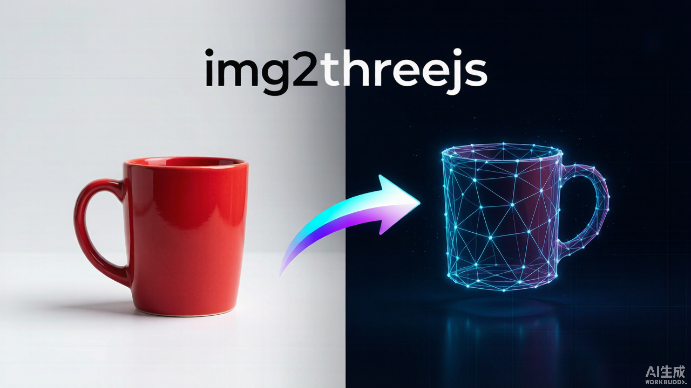
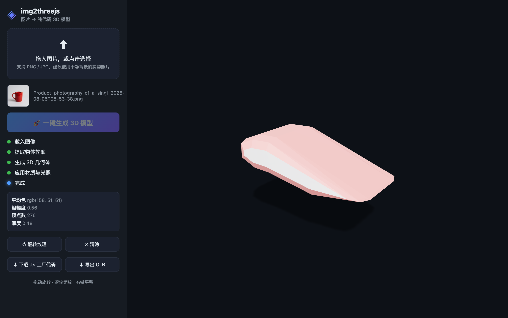
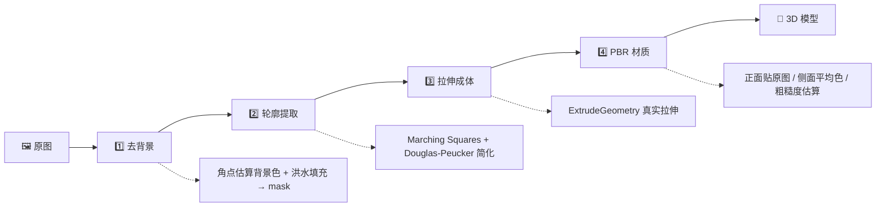

<div align="center">

# img2threejs-web

**拖入一张图片，一键生成可在浏览器里旋转的 Three.js 3D 模型。**

纯前端 · 零后端 · 无需 AI 训练 · 真实几何体（轮廓拉伸，不是贴图卡片）

[](https://github.com/PhiloKun/img2threejs-web)
[](https://gitee.com/PhiloKun/img2threejs-web)
[](LICENSE)
[](https://threejs.org)
[](https://vitejs.dev)
[](https://www.typescriptlang.org)

<br>



</div>

---

## 📌 这是什么

`img2threejs-web` 有两条使用路径：

| 路径 | 适合谁 | 说明 |
| --- | --- | --- |
| **🖥️ Web 应用（推荐）** | 想开箱即用的用户 | 打开网页 → 拖图 → 点生成 → 立刻得到可交互 3D 模型。 |
| **🔧 forge 技能库** | 想更高保真、由 Agent 驱动的开发者 | 上游 `img2threejs` 的多阶段 Python 管线，输出动画就绪的纯代码模型。 |

> 本仓库基于 [img2threejs](https://github.com/img2threejs/img2threejs)（作者 hoainho，Apache 2.0）改造，新增了 `web/` 一键式前端应用。

---

## 🚀 30 秒上手

> 前置：本地安装 **Node.js 18+**。

```bash
# 1. 克隆仓库
git clone https://github.com/PhiloKun/img2threejs-web.git
cd img2threejs-web

# 2. 安装依赖（仅首次）
npm run setup

# 3. 启动 Web 应用
npm run web          # → http://localhost:5173
```

> 💡 macOS / Linux 用户也可以直接双击运行 `./start.sh`（首次会自动装依赖）。

然后打开 **http://localhost:5173**，拖入一张物体照片，点击 **「🚀 一键生成 3D 模型」**。

---

## ✨ 核心特性

| 特性 | 说明 |
| --- | --- |
| 🖼️ **拖拽上传** | 支持 PNG / JPG，建议主体清晰、背景干净的实物照片。 |
| 🚀 **一键生成** | 自动抠图 → 提取轮廓 → 拉伸成 3D 实体 → 贴图与材质一气呵成。 |
| 🧊 **真实 3D 几何体** | marching-squares 提取轮廓 + `ExtrudeGeometry` 真正拉伸，不是贴图卡片。 |
| 🎨 **PBR 材质** | 正面贴原图，侧面用提取平均色；配 `RoomEnvironment` 环境反射 + 实时阴影。 |
| 🕹️ **可交互查看** | 拖动旋转、滚轮缩放、右键平移；相机自动取景。 |
| 📦 **一键导出** | 下载 `.glb` 3D 文件，或下载纯代码 `.ts` 工厂模块（图片已内嵌 base64）。 |
| ⚡ **纯前端运行** | Vite + Three.js，无后端、无模型训练、无隐私上传。 |

---

## 🖼️ 真实效果

<div align="center">



*左侧：上传区与生成进度；右侧：可旋转、可缩放的 Three.js 3D 模型*

</div>

---

## 🎮 使用步骤

1. **导入图片**：把图片拖进左侧上传区，或点击选择文件。
2. **一键生成**：点击「🚀 一键生成 3D 模型」。
3. **交互查看**：右侧画布实时出现 3D 模型，左键旋转、滚轮缩放、右键平移。
4. **微调与导出**：
   - 贴图方向不对 → 点「↻ 翻转纹理」。
   - 保存 3D 文件 → 点「⬇ 导出 GLB」。
   - 拿到纯代码 Three.js 模块 → 点「⬇ 下载 .ts 工厂代码」。

> 📝 **提示**：用干净背景、主体清晰的实物照片效果最好。当前为「轮廓拉伸」方案，能还原物体外形并贴图；像马克杯把手这类**内凹细节**会被轮廓简化吃掉。追求更高保真请看「进阶用法」。

---

## 🧠 工作原理

核心代码在 [`web/src/core/pipeline.ts`](web/src/core/pipeline.ts)，全部在浏览器内完成：



- **去背景**：角点估算背景色 + 洪水填充去阴影，得到物体掩膜。
- **轮廓提取**：marching-squares 提取轮廓点，Douglas-Peucker 简化，凸包兜底保证闭合。
- **拉伸成体**：`ExtrudeGeometry` 沿轮廓真正拉伸成 3D 实体，caps 用自定义 UVGenerator 把原图贴到正/背面。
- **PBR 材质**：正面 = 原图纹理；侧面 = 提取出的平均色；粗糙度由图像方差估算；配 `RoomEnvironment` + 实时阴影。

导出逻辑见 [`web/src/core/exporter.ts`](web/src/core/exporter.ts)：`.glb` 由 `GLTFExporter` 生成，`.ts` 工厂代码由模板字符串生成。

---

## 🗂️ 目录结构

```text
img2threejs-web/
├── web/                      # 一键式 Web 应用（Vite + Three.js）
│   ├── index.html            # 页面结构
│   ├── src/
│   │   ├── main.ts           # UI 编排 + Three.js 场景
│   │   └── core/
│   │       ├── pipeline.ts   # 图 → 3D 核心管线
│   │       └── exporter.ts   # GLB / .ts 工厂代码导出
│   └── package.json
├── forge/                    # 上游 img2threejs 技能库（agent 驱动）
│   ├── stage1_intake/        # 图像导入、轮廓/细节分析
│   ├── stage2_spec/          # 规格生成与严格质量门控
│   └── stage3_build/         # 生成 Three.js 工厂代码
├── start.sh                  # macOS / Linux 一键启动脚本
├── package.json              # 根脚本：setup / web / start / build / preview
└── README.md
```

---

## ⚙️ 常用命令

| 命令 | 作用 |
| --- | --- |
| `npm run setup` | 安装依赖（仅首次） |
| `npm run web` | 启动开发服务器（默认 5173 端口） |
| `npm run start` | 启动并监听 `--host`（局域网可访问） |
| `npm run build` | 打包到 `web/dist/` |
| `npm run preview` | 预览打包产物（4173 端口） |

---

## 🔧 进阶用法：forge 技能库（更高保真）

如果你想要**动画就绪、近乎照片级**的纯代码模型（而不是轮廓拉伸近似），可以用上游的 `forge/` Python 管线——由 Agent 完成视觉判断与写代码，确定性脚本只负责校验与质量门控。

```bash
# 仅依赖 Python 3.10+ 标准库，无需 pip install
python3 forge/stage1_intake/probe_image.py <image>
python3 forge/stage2_spec/new_pre_spec_assessment.py "Name" --image <image> --out assessment.json
python3 forge/stage2_spec/new_sculpt_spec.py "Name" --image <image> --assessment assessment.json --out spec.json
python3 forge/stage2_spec/validate_sculpt_spec.py spec.json --strict-quality
python3 forge/stage3_build/generate_threejs_factory.py spec.json --out src/createObjectModel.ts
```

> 详细架构与脚本参考见 [`docs/ARCHITECTURE.md`](docs/ARCHITECTURE.md)。

---

## 📦 构建与部署

打包为纯静态站点，可部署到任意静态托管（GitHub Pages、Gitee Pages、Vercel、Netlify、Cloudflare Pages、对象存储等）：

```bash
npm run build        # 产物在 web/dist/
# 把 web/dist/ 上传到你的静态托管即可
```

### 一键部署示例

| 平台 | 方式 |
| --- | --- |
| **Vercel** | `vercel --cwd web/dist` |
| **GitHub Pages** | 把 `web/dist/` 推送到 `gh-pages` 分支 |
| **Gitee Pages** | 在 Gitee 仓库开启 Pages，选择 `web/dist` 目录 |

---

## ☁️ 在线演示

- 🌐 **临时云预览**（CloudStudio，可能过期）：<https://9e57408bd09c44248cf20706891e30d1.sh4.agentos-app.net>
- 想要长期稳定？按「构建与部署」把 `web/dist/` 部署到你自己的静态托管即可。

---

## 📄 许可证

[Apache License 2.0](LICENSE)。

本仓库在 [img2threejs](https://github.com/img2threejs/img2threejs)（hoainho，Apache 2.0）基础上新增 `web/` 前端应用，整体沿用 Apache 2.0。

---

## 🙏 参考与致谢

- 上游技能库与思路：[img2threejs](https://github.com/img2threejs/img2threejs)
- 由代码生成的模型示范画廊：[img2threejs-showcase](https://img2threejs.github.io/img2threejs-showcase/)
- 渲染引擎：[Three.js](https://threejs.org)
